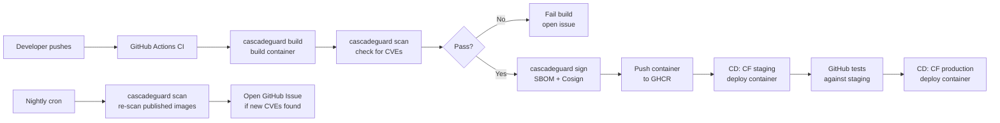

# How-to: GitHub CI + Cloudflare Workers CD

This guide walks through using CascadeGuard to manage container images in a pipeline where **GitHub Actions** builds, scans, and signs your images and **Cloudflare Workers** serves the deployed container.

You will use the CascadeGuard CLI to enrol your image, generate state files, and generate the complete CI/CD pipeline — including the Cloudflare staging and production deploy steps. See [cascadeguard-exemplar](https://github.com/cascadeguard/cascadeguard-exemplar) for a working example of the generated output.

## Prerequisites

- A working CascadeGuard installation (`cascadeguard --version` returns a version string; see [Getting Started](../getting-started.md) to install)
- A GitHub repository containing a `Dockerfile`
- A Cloudflare account with Workers enabled and `CLOUDFLARE_API_TOKEN` / `CLOUDFLARE_ACCOUNT_ID` ready to add as GitHub repository secrets
- A state repository (a separate Git repo) to host CascadeGuard configuration and generated pipelines

---

## Architecture



The flow is:
1. `cascadeguard images enrol` adds your image to `images.yaml`, including a deploy workflow configuration.
2. `cascadeguard generate` reads the registry and writes per-image state files.
3. `cascadeguard generate-ci` produces the complete GitHub Actions pipeline: container build/scan/sign + Cloudflare staging deploy + test gate + Cloudflare production deploy.
4. The nightly `cascadeguard scan` re-checks published images against the latest vulnerability databases without rebuilding.

---

## Step 1 — Install CascadeGuard

If you haven't already installed CascadeGuard, the quickest path is the shell wrapper:

```bash
curl -fsSL https://github.com/cascadeguard/cascadeguard/releases/latest/download/install.sh | sh
```

This installs a `cascadeguard` command that delegates to the Docker image under the hood — no local Python setup needed.

Verify the install:

```bash
cascadeguard --version
```

> **Tip:** If you prefer not to install the wrapper, all commands in this guide can also be run via `task` (from the shared Taskfile) or directly with `docker run`. See [Getting Started](../getting-started.md) for both options.

---

## Step 2 — Initialise your state repository

Create a new Git repository for CascadeGuard state. This repo stores your image enrollment config, generated state files, and CI/CD pipelines.

```bash
mkdir my-state-repo && cd my-state-repo
git init
```

Add `.cascadeguard.yaml` to set the target CI platform and the CascadeGuard version to use:

```yaml
# .cascadeguard.yaml
image: ghcr.io/cascadeguard/cascadeguard
version: v1.0.0

ci:
  platform: github
```

Include the shared Taskfile (optional, but convenient for local runs):

```yaml
# Taskfile.yaml
version: '3'
includes:
  shared:
    taskfile: https://raw.githubusercontent.com/cascadeguard/cascadeguard/v1.0.0/Taskfile.shared.yaml
    flatten: true
```

---

## Step 3 — Enrol your image

Use `cascadeguard images enrol` to add your image to `images.yaml`. The `--deploy` flags tell `generate-ci` what CD pipeline to produce.

```bash
cascadeguard images enrol \
  --name my-app \
  --registry ghcr.io \
  --repository your-org/my-app \
  --provider github \
  --repo your-org/my-app \
  --dockerfile Dockerfile \
  --branch main \
  --rebuild-delay 7d \
  --auto-rebuild \
  --deploy cloudflare-workers \
  --deploy-project my-app \
  --deploy-staging-environment staging \
  --deploy-production-environment production
```

This writes an entry to `images.yaml`:

```yaml
# images.yaml
- name: my-app
  registry: ghcr.io
  repository: your-org/my-app
  source:
    provider: github
    repo: your-org/my-app
    dockerfile: Dockerfile
    branch: main
  rebuildDelay: 7d
  autoRebuild: true
  deploy:
    provider: cloudflare-workers
    project: my-app
    workflows:
      - name: staging
        environment: staging
      - name: production
        environment: production
        gate: staging
```

The `workflows` list declares the CD stages. `generate-ci` uses this to wire up a staging deploy → test gate → production deploy sequence in the generated GitHub Actions pipeline.

---

## Step 4 — Generate state files

```bash
cascadeguard generate
```

This reads `images.yaml`, inspects the registry, and writes per-image state to `cascadeguard/state/`. On first run the state files show no prior build; they are populated after the first CI run.

---

## Step 5 — Generate the CI/CD pipeline

```bash
cascadeguard generate-ci
```

Because your `images.yaml` entry declares a `deploy` section with Cloudflare Workers, `generate-ci` emits a complete pipeline including the CD stages:

| File | Trigger | What it does |
|---|---|---|
| `build-image.yaml` | `workflow_call` | Build container → scan → generate SBOM → sign → push to GHCR |
| `ci.yaml` | Push to `main`, pull requests | Matrix build; on `main` also triggers CD workflows |
| `deploy-staging.yaml` | Called by `ci.yaml` on `main` | Pull container from GHCR and deploy to Cloudflare Workers (staging) |
| `run-tests.yaml` | Called after staging deploy | Run acceptance tests against the staging Worker URL |
| `deploy-production.yaml` | Called after tests pass | Deploy container to Cloudflare Workers (production) |
| `scheduled-scan.yaml` | Nightly cron | Re-scan published images; open GitHub Issues on new CVEs |
| `release.yaml` | Tag push (`v*`) | Build, sign, and push with release tag |

> **Do not edit these files by hand.** They carry an `# Auto-generated by CascadeGuard` header. Re-run `cascadeguard generate-ci` after any `images.yaml` change.

Commit and push everything:

```bash
git add .
git commit -m "chore: initialise CascadeGuard state and CI/CD"
git push
```

---

## Step 6 — Add repository secrets

Add these secrets to your GitHub repository (Settings → Secrets and variables → Actions):

| Secret | Value |
|---|---|
| `CLOUDFLARE_API_TOKEN` | A Cloudflare API token with Workers deploy permission |
| `CLOUDFLARE_ACCOUNT_ID` | Your Cloudflare account ID |

`GITHUB_TOKEN` is injected automatically and requires no manual setup.

The generated workflows request these permissions (already set in the generated files):

```yaml
permissions:
  contents: read
  packages: write      # push container to GHCR
  id-token: write      # Cosign keyless signing via OIDC
  issues: write        # open issues when new CVEs are found
```

---

## Step 7 — Verify the pipeline

After pushing, GitHub Actions will trigger. Once CI completes, confirm the image and deployment are healthy:

```bash
# Check current image status: digest, last build time, base image deps
cascadeguard status

# Run a manual scan against the published image
cascadeguard scan ghcr.io/your-org/my-app:latest
```

`cascadeguard status` prints a table of every managed image showing version, registry digest, build time, and dependency relationships. `cascadeguard scan` prints scan results matching what CI would report — useful for debugging a failed build locally.

---

## Optional — Switch to CascadeGuard managed secure base images

CascadeGuard publishes regularly-updated, pre-scanned base images via [cascadeguard-open-secure-images](https://github.com/cascadeguard/cascadeguard-open-secure-images). Switching to a managed base image means CascadeGuard will automatically queue a rebuild of your image whenever the base is updated.

Update your `Dockerfile`:

```dockerfile
# Before
FROM nginx:1.27-alpine

# After — CascadeGuard managed image
FROM ghcr.io/cascadeguard/nginx:1.27-alpine
```

Then re-run `cascadeguard generate` to update state and `cascadeguard generate-ci` to regenerate pipelines. The `autoRebuild: true` flag in `images.yaml` handles triggering rebuilds automatically on any future base image update.

---

## Next steps

- [Getting Started](../getting-started.md) — installation and first setup
- [CLI Reference](../reference/cli.md) — full reference for `cascadeguard images enrol`, `scan`, `status`, `generate-ci`, and all other commands
- [GitHub Actions Integration Guide](../integrations/github-actions.md) — how the generated workflows are structured and how to customise them
- [Security Model](../security-model.md) — SBOM generation, Cosign signing, and scan gating
- [cascadeguard-exemplar](https://github.com/cascadeguard/cascadeguard-exemplar) — a working state repository with real generated workflows
- [GitLab CI + Argo CD](gitlab-argocd.md) — the same walkthrough for GitLab + ArgoCD + Kargo
