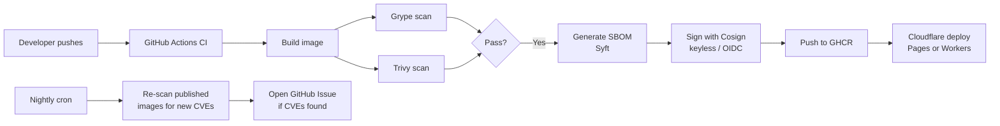

# How-to: GitHub CI + Cloudflare CD

This guide walks through using CascadeGuard in a pipeline where **GitHub Actions** builds, scans, and signs your container images and **Cloudflare Pages / Workers** serves the deployed application.

This is CascadeGuard's own setup. The workflows and configuration shown here are drawn directly from the [cascadeguard-app](https://github.com/cascadeguard/cascadeguard-app) and [cascadeguard-exemplar](https://github.com/cascadeguard/cascadeguard-exemplar) repositories.

## Prerequisites

- A GitHub repository with a `Dockerfile` (or a mono-repo with image subdirectories)
- A Cloudflare account with a Pages or Workers project
- A state repository to host CascadeGuard configuration and generated pipelines
- `CLOUDFLARE_API_TOKEN` and `CLOUDFLARE_ACCOUNT_ID` secrets ready to add to GitHub

---

## Architecture



The key properties of this pipeline:

- **Every image is scanned twice** — Grype and Trivy both run on every build; either can block a merge.
- **Signing is keyless** — Cosign uses GitHub's OIDC token, so no long-lived signing secrets are needed.
- **Drift is detected automatically** — The nightly scheduled scan re-checks published images against the latest vulnerability databases without rebuilding.
- **Cloudflare deployment gates on CI** — The deploy workflow only runs after the image build and scan steps pass.

---

## Step 1 — Initialise your state repository

Create a new Git repository for CascadeGuard state. This repo holds your image enrollment config, generated state files, and CI pipelines.

```bash
mkdir my-state-repo && cd my-state-repo
git init
```

Add `images.yaml` to declare the images you want CascadeGuard to manage:

```yaml
# images.yaml
- name: my-app
  registry: ghcr.io
  repository: your-org/my-app
  source:
    provider: github
    repo: your-org/my-app
    dockerfile: Dockerfile
    branch: main
  rebuildDelay: 7d
  autoRebuild: true
```

Add `.cascadeguard.yaml` to configure the tool:

```yaml
# .cascadeguard.yaml
image: ghcr.io/cascadeguard/cascadeguard
version: v1.0.0

ci:
  platform: github
```

Include the shared Taskfile so you can run CascadeGuard commands without a local Python install:

```yaml
# Taskfile.yaml
version: '3'
includes:
  shared:
    taskfile: https://raw.githubusercontent.com/cascadeguard/cascadeguard/v1.0.0/Taskfile.shared.yaml
    flatten: true
```

---

## Step 2 — Enrol your images

Use the `enrol` command to add images to `images.yaml`. If you already wrote the file by hand you can skip this step.

```bash
cascadeguard --images-yaml images.yaml enrol \
  --name my-app \
  --registry ghcr.io \
  --repository your-org/my-app \
  --provider github \
  --repo your-org/my-app \
  --dockerfile Dockerfile \
  --branch main \
  --rebuild-delay 7d
```

Then generate the initial state files:

```bash
task generate
```

This reads `images.yaml`, queries the registry, and writes per-image state to `cascadeguard/state/`.

---

## Step 3 — Generate the CI pipeline

```bash
task generate-ci
```

This emits four GitHub Actions workflow files under `.github/workflows/`:

| File | Trigger | What it does |
|---|---|---|
| `build-image.yaml` | `workflow_call` | Reusable: build → Grype scan → Trivy scan → SBOM → Cosign sign → push |
| `ci.yaml` | Push to `main`, pull requests | Matrix build across all images in `images.yaml` |
| `scheduled-scan.yaml` | Nightly cron | Re-scans published images; opens GitHub Issues on new CVEs |
| `release.yaml` | Tag push (`v*`) | Builds, signs, and pushes with a release tag |

> **Do not edit these files by hand.** They carry an `# Auto-generated by CascadeGuard` header. Any edits will be overwritten the next time you run `generate-ci`.

Commit and push to your state repo:

```bash
git add .
git commit -m "chore: initialise CascadeGuard state and CI"
git push
```

---

## Step 4 — Add repository secrets

The generated workflows require two GitHub repository secrets:

| Secret | Value |
|---|---|
| `CLOUDFLARE_API_TOKEN` | A Cloudflare API token with Pages / Workers deploy permission |
| `CLOUDFLARE_ACCOUNT_ID` | Your Cloudflare account ID |

`GITHUB_TOKEN` is injected automatically by GitHub Actions and requires no manual setup.

The generated CI workflows also need these **permissions** on the workflow or repository level:

```yaml
permissions:
  contents: read
  packages: write      # push to GHCR
  id-token: write      # Cosign keyless signing via OIDC
  issues: write        # scheduled-scan.yaml opens issues on new CVEs
```

These permissions are already present in the generated files.

---

## Step 5 — Add the Cloudflare deploy step

The generated `ci.yaml` handles the image build pipeline. You add a separate job (or workflow) that runs the Cloudflare deployment after images pass scanning.

### Cloudflare Pages (static frontend)

```yaml
# .github/workflows/deploy-web.yaml
name: Deploy Web

on:
  push:
    branches: [main]
    paths:
      - 'packages/web/**'

jobs:
  staging:
    name: Deploy to staging
    runs-on: ubuntu-latest
    environment: staging
    steps:
      - uses: actions/checkout@v4

      - name: Set up Node.js
        uses: actions/setup-node@v4
        with:
          node-version: '20'
          cache: 'npm'

      - name: Install dependencies
        run: npm ci

      - name: Build
        run: npm run build
        env:
          VITE_API_URL: ${{ secrets.VITE_API_URL_STAGING }}

      - name: Deploy to Cloudflare Pages (staging)
        uses: cloudflare/wrangler-action@v3
        with:
          apiToken: ${{ secrets.CLOUDFLARE_API_TOKEN }}
          accountId: ${{ secrets.CLOUDFLARE_ACCOUNT_ID }}
          command: pages deploy dist --project-name=my-app --branch=staging

  production:
    name: Deploy to production
    needs: [staging]
    runs-on: ubuntu-latest
    environment: production
    steps:
      - uses: actions/checkout@v4

      - name: Set up Node.js
        uses: actions/setup-node@v4
        with:
          node-version: '20'
          cache: 'npm'

      - name: Install dependencies
        run: npm ci

      - name: Build
        run: npm run build
        env:
          VITE_API_URL: ${{ secrets.VITE_API_URL }}

      - name: Deploy to Cloudflare Pages (production)
        uses: cloudflare/wrangler-action@v3
        with:
          apiToken: ${{ secrets.CLOUDFLARE_API_TOKEN }}
          accountId: ${{ secrets.CLOUDFLARE_ACCOUNT_ID }}
          command: pages deploy dist --project-name=my-app --branch=main
```

### Cloudflare Workers (API / backend)

For a Python or TypeScript Worker, use `wrangler deploy` with a `wrangler.toml`:

```yaml
      - name: Deploy Worker
        uses: cloudflare/wrangler-action@v3
        with:
          apiToken: ${{ secrets.CLOUDFLARE_API_TOKEN }}
          accountId: ${{ secrets.CLOUDFLARE_ACCOUNT_ID }}
          command: deploy --env production
          workingDirectory: api
```

**Staging-before-production pattern:** Both examples above deploy to staging first, run a smoke test, then gate production on staging passing. This pattern is used in the CascadeGuard production setup.

---

## Step 6 — Pin your GitHub Actions

With CascadeGuard's `actions pin` command, you can lock every `uses:` line in your workflows to an exact commit SHA. This prevents supply-chain attacks where a mutable tag (like `@v3`) is silently updated.

```bash
cascadeguard actions pin --workflow .github/workflows/deploy-web.yaml
```

Or pin all workflows at once:

```bash
cascadeguard actions pin
```

Each step changes from:

```yaml
uses: actions/checkout@v4
```

to:

```yaml
uses: actions/checkout@34e114876b0b11c390a56381ad16ebd13914f8d5 # v4
```

You can also enforce this across your repo with the `cascadeguard actions audit` command — or add an `enforce-actions-policy.yaml` workflow that blocks merges if any unpinned actions are found.

---

## Step 7 — Verify the pipeline

After pushing to your state repo, GitHub Actions should trigger automatically. Check the following:

```bash
# View current image status (versions, digests, build times, dependency graph)
cascadeguard --state-dir cascadeguard/state status
# or via task:
task status
```

Expected output includes a table showing each managed image, its current digest, when it was last built, and which base images it depends on.

```bash
# Run a manual scan against a published image
cascadeguard scan ghcr.io/your-org/my-app:latest
```

This prints the scan results from both Grype and Trivy, matching what CI would report.

---

## Optional — Switch to CascadeGuard managed secure base images

CascadeGuard publishes a set of hardened base images from [cascadeguard-open-secure-images](https://github.com/cascadeguard/cascadeguard-open-secure-images). These are pre-scanned, regularly updated, and signed.

To use a managed base image, update your `Dockerfile`:

```dockerfile
# Before
FROM python:3.12-slim

# After — pinned to a CascadeGuard managed image
FROM ghcr.io/cascadeguard/python:3.12-slim
```

Then update `images.yaml` to reflect the new base:

```yaml
- name: my-app
  registry: ghcr.io
  repository: your-org/my-app
  source:
    provider: github
    repo: your-org/my-app
    dockerfile: Dockerfile
    branch: main
  rebuildDelay: 7d
  autoRebuild: true
```

Because `autoRebuild: true` is set, CascadeGuard will automatically queue a rebuild of `my-app` whenever the managed base image is updated. You do not need to manually track upstream base image versions.

---

## Next steps

- [CLI Reference](../reference/cli.md) — `cascadeguard scan`, `cascadeguard status`, `cascadeguard actions pin`, and all other commands
- [GitHub Actions Integration Guide](../integrations/github-actions.md) — how the generated workflows are structured and how to customise them
- [Security Model](../security-model.md) — how CascadeGuard handles SBOM generation, Cosign signing, and scan gating
- [cascadeguard-exemplar](https://github.com/cascadeguard/cascadeguard-exemplar) — a working state repository with real generated workflows
- [GitLab CI + Argo CD guide](gitlab-argocd.md) — the same walkthrough for GitLab + ArgoCD + Kargo
