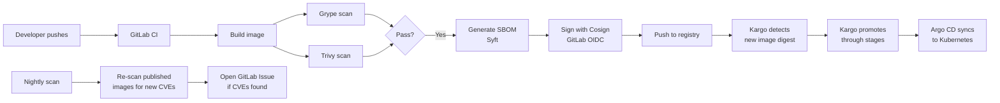

# How-to: GitLab CI + Argo CD

This guide walks through using CascadeGuard in a pipeline where **GitLab CI/CD** builds, scans, and signs your container images and **Argo CD + Kargo** orchestrates Kubernetes deployment.

> **Note on GitLab CI support:** `cg tools generate` currently generates GitHub Actions workflows only. GitLab CI support is planned. Until then, this guide shows the equivalent `.gitlab-ci.yml` configuration you would write manually. All other CascadeGuard commands (`images enrol`, `images generate`, `images check`, `images status`) work the same regardless of CI platform.

## Prerequisites

- A GitLab repository with a `Dockerfile` (or a mono-repo with image subdirectories)
- A container registry — GitLab Container Registry (`registry.gitlab.com`) or GitHub Container Registry (`ghcr.io`) both work
- A state repository to host CascadeGuard configuration and generated manifests
- Argo CD and Kargo running in your Kubernetes cluster
- GitLab 15.7 or later (for OIDC-based keyless signing with Cosign)

---

## Architecture



The key properties of this pipeline:

- **Every image is scanned twice** — Grype and Trivy both run on every build; either can block a merge.
- **Signing is keyless** — Cosign uses GitLab's OIDC token, so no long-lived signing keys are stored in CI variables.
- **Promotion is gated** — Kargo only advances an image to the next stage when scan analysis passes.
- **Drift is detected automatically** — A nightly scheduled pipeline re-checks published images for newly disclosed CVEs.

---

## Step 1 — Initialise your state repository

Create a new Git repository for CascadeGuard state. This repo holds your image enrollment config, generated state files, and Kargo/Argo CD manifests.

```bash
mkdir my-state-repo && cd my-state-repo
git init
```

Add `images.yaml` to declare the images you want CascadeGuard to manage:

```yaml
# images.yaml
- name: my-app
  registry: registry.gitlab.com
  repository: your-group/my-app
  source:
    provider: gitlab
    repo: your-group/my-app
    dockerfile: Dockerfile
    branch: main
  rebuildDelay: 7d
  autoRebuild: true
```

Add `.cascadeguard.yaml` to configure the tool:

```yaml
# .cascadeguard.yaml
image: ghcr.io/cascadeguard/cascadeguard
version: v1.0.0

ci:
  platform: github   # generate-ci is currently GitHub-only; see Step 3
```

Include the shared Taskfile so you can run CascadeGuard commands without a local Python install:

```yaml
# Taskfile.yaml
version: '3'
includes:
  shared:
    taskfile: https://raw.githubusercontent.com/cascadeguard/cascadeguard/v1.0.0/Taskfile.shared.yaml
    flatten: true
```

---

## Step 2 — Enrol your images

Use the `enrol` command to add images to `images.yaml`. If you already wrote the file by hand you can skip this step.

```bash
cg images enrol \
  --name my-app \
  --registry registry.gitlab.com \
  --repository your-group/my-app \
  --provider gitlab \
  --repo your-group/my-app \
  --dockerfile Dockerfile \
  --branch main \
  --rebuild-delay 7d
```

Then generate the initial state files:

```bash
task generate
```

This reads `images.yaml`, queries the registry, and writes per-image state to `cascadeguard/state/`.

---

## Step 3 — Generate Kargo manifests

```bash
task synth
```

This generates Kargo Warehouses, Stages, and AnalysisTemplates under `dist/`. Argo CD watches this directory and applies the manifests to your cluster.

> **GitLab CI limitation:** `cg tools generate` emits GitHub Actions workflows only. GitLab CI pipeline generation is planned for a future release. Step 4 shows the equivalent `.gitlab-ci.yml` you write manually.

Commit and push to your state repo:

```bash
git add .
git commit -m "chore: initialise CascadeGuard state and Kargo manifests"
git push
```

---

## Step 4 — Write the GitLab CI pipeline

Create `.gitlab-ci.yml` in your **application repository** (the repo that contains your `Dockerfile`). This replaces what `generate-ci` would emit for GitHub Actions.

```yaml
# .gitlab-ci.yml

stages:
  - build
  - scan
  - attest
  - push

variables:
  IMAGE: "${CI_REGISTRY_IMAGE}:${CI_COMMIT_SHORT_SHA}"
  IMAGE_LATEST: "${CI_REGISTRY_IMAGE}:latest"

# ── Build ────────────────────────────────────────────────────────────────────

build:
  stage: build
  image: docker:24
  services:
    - docker:24-dind
  before_script:
    - docker login -u "$CI_REGISTRY_USER" -p "$CI_REGISTRY_PASSWORD" "$CI_REGISTRY"
  script:
    - docker build -t "$IMAGE" -t "$IMAGE_LATEST" .
    - docker save "$IMAGE" | gzip > image.tar.gz
  artifacts:
    paths:
      - image.tar.gz
    expire_in: 1 hour

# ── Scan ─────────────────────────────────────────────────────────────────────

grype-scan:
  stage: scan
  image: anchore/grype:latest
  needs: [build]
  before_script:
    - docker load < image.tar.gz
  script:
    - grype "$IMAGE" --fail-on high
  services:
    - docker:24-dind

trivy-scan:
  stage: scan
  image: aquasec/trivy:latest
  needs: [build]
  before_script:
    - docker load < image.tar.gz
  script:
    - trivy image --exit-code 1 --severity HIGH,CRITICAL "$IMAGE"
  services:
    - docker:24-dind

# ── SBOM + Sign ───────────────────────────────────────────────────────────────

sbom-and-sign:
  stage: attest
  image: alpine:3.19
  needs: [grype-scan, trivy-scan]
  id_tokens:
    SIGSTORE_ID_TOKEN:
      aud: sigstore
  before_script:
    - apk add --no-cache curl docker cosign syft
    - docker login -u "$CI_REGISTRY_USER" -p "$CI_REGISTRY_PASSWORD" "$CI_REGISTRY"
    - docker load < image.tar.gz
  script:
    # Generate SBOM
    - syft "$IMAGE" -o spdx-json > sbom.spdx.json
    # Push image before signing (signing requires the image to be in the registry)
    - docker push "$IMAGE"
    - docker push "$IMAGE_LATEST"
    # Sign image keylessly using GitLab's OIDC token
    - cosign sign --yes "$IMAGE"
    # Attest SBOM
    - cosign attest --yes --predicate sbom.spdx.json --type spdxjson "$IMAGE"
  artifacts:
    paths:
      - sbom.spdx.json
    expire_in: 30 days
  rules:
    - if: $CI_COMMIT_BRANCH == "main"

# ── Nightly re-scan ───────────────────────────────────────────────────────────

nightly-scan:
  stage: scan
  image: aquasec/trivy:latest
  script:
    - trivy image --exit-code 0 --severity HIGH,CRITICAL --format json "$IMAGE_LATEST" > trivy-report.json
    # If new CVEs are found, open a GitLab issue via the API
    - |
      CVE_COUNT=$(cat trivy-report.json | grep -c '"VulnerabilityID"' || true)
      if [ "$CVE_COUNT" -gt "0" ]; then
        curl --request POST \
          --header "PRIVATE-TOKEN: $GITLAB_API_TOKEN" \
          "$CI_API_V4_URL/projects/$CI_PROJECT_ID/issues" \
          --data "title=CascadeGuard: new CVEs found in $IMAGE_LATEST&description=$(cat trivy-report.json)"
      fi
  rules:
    - if: $CI_PIPELINE_SOURCE == "schedule"
```

### Key differences from GitHub Actions

| Feature | GitHub Actions | GitLab CI |
|---|---|---|
| Keyless signing | OIDC via `permissions: id-token: write` | `id_tokens:` block with `aud: sigstore` |
| Registry auth | `GITHUB_TOKEN` injected automatically | `CI_REGISTRY_*` variables injected automatically |
| Scheduled scans | `schedule:` trigger in workflow | GitLab pipeline schedule (Settings → CI/CD → Schedules) |
| Artifact storage | `actions/upload-artifact` | `artifacts:` block |

---

## Step 5 — Configure CI variables

The pipeline above uses GitLab's automatically injected variables for registry auth (`CI_REGISTRY_USER`, `CI_REGISTRY_PASSWORD`, `CI_REGISTRY`). You do not need to set these manually.

For the nightly CVE issue-opener, add one manual variable in **Settings → CI/CD → Variables**:

| Variable | Value |
|---|---|
| `GITLAB_API_TOKEN` | A GitLab personal access token with `api` scope |

For Cosign keyless signing, no additional secrets are required — the `id_tokens:` block in the `sbom-and-sign` job fetches a short-lived OIDC token from GitLab automatically.

---

## Step 6 — Configure Argo CD

Argo CD watches the `dist/` directory in your state repository and deploys the Kargo manifests. Point an Argo CD Application at your state repo:

```yaml
# argocd-app.yaml — apply this to your cluster once
apiVersion: argoproj.io/v1alpha1
kind: Application
metadata:
  name: my-app-kargo
  namespace: argocd
spec:
  project: default
  source:
    repoURL: https://gitlab.com/your-group/my-state-repo.git
    targetRevision: HEAD
    path: dist
  destination:
    server: https://kubernetes.default.svc
    namespace: kargo
  syncPolicy:
    automated:
      prune: true
      selfHeal: true
```

```bash
kubectl apply -f argocd-app.yaml
```

Argo CD will detect the `dist/` manifests and sync them to your cluster. Kargo then monitors the container registry for new image digests and promotes them through your configured stages.

### Kargo promotion flow

Once Kargo is running, the standard promotion flow is:

1. GitLab CI pushes a new signed image to the registry
2. Kargo's Warehouse detects the new digest
3. Kargo runs AnalysisTemplate checks (scan results, signature verification)
4. On pass, Kargo promotes the image to the next Stage
5. Argo CD syncs the updated manifest to the Kubernetes cluster

---

## Step 7 — Verify the pipeline

After pushing to your state repo and application repo:

```bash
# View current image status (versions, digests, build times, dependency graph)
cg images status

# Run a check against enrolled images
cg images check
```

Expected output shows each managed image, its current digest, when it was last built, and which base images it depends on.

```bash
# Run a manual scan against a published image
cg scan registry.gitlab.com/your-group/my-app:latest
```

This prints scan results from both Grype and Trivy, matching what CI would report.

---

## Optional — Switch to CascadeGuard managed secure base images

CascadeGuard publishes a set of hardened base images from [cascadeguard-open-secure-images](https://github.com/cascadeguard/cascadeguard-open-secure-images). These are pre-scanned, regularly updated, and signed.

To use a managed base image, update your `Dockerfile`:

```dockerfile
# Before
FROM python:3.12-slim

# After — pinned to a CascadeGuard managed image
FROM ghcr.io/cascadeguard/python:3.12-slim
```

Then update `images.yaml` to reflect the new base. Because `autoRebuild: true` is set, CascadeGuard will automatically queue a rebuild of `my-app` whenever the managed base image is updated.

---

## Known gaps (GitLab CI)

| Feature | Status |
|---|---|
| `cg tools generate` for GitLab | Planned — manual `.gitlab-ci.yml` required today |
| `cg pipeline build` command | GitHub-only (uses GitHub Actions API) |
| `cg pipeline test` command | GitHub-only (queries GitHub Actions) |
| Keyless signing | Supported via GitLab OIDC (requires GitLab 15.7+) |
| `cg scan`, `images status`, `images enrol`, `synth` | Fully supported |

---

## Next steps

- [CLI Reference](../reference/cli.md) — `cg scan`, `cg images status`, `cg images enrol`, and all other commands
- [GitHub Actions Integration Guide](../integrations/github-actions.md) — how the generated workflows are structured (useful reference even when writing GitLab CI manually)
- [Security Model](../security-model.md) — how CascadeGuard handles SBOM generation, Cosign signing, and scan gating
- [cascadeguard-exemplar](https://github.com/cascadeguard/cascadeguard-exemplar) — a working state repository with real generated workflows
- [GitHub CI + Cloudflare CD guide](github-cloudflare.md) — the same walkthrough for GitHub Actions + Cloudflare
