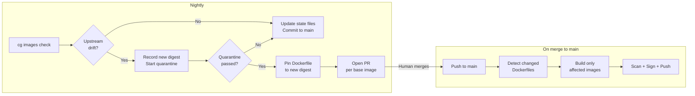
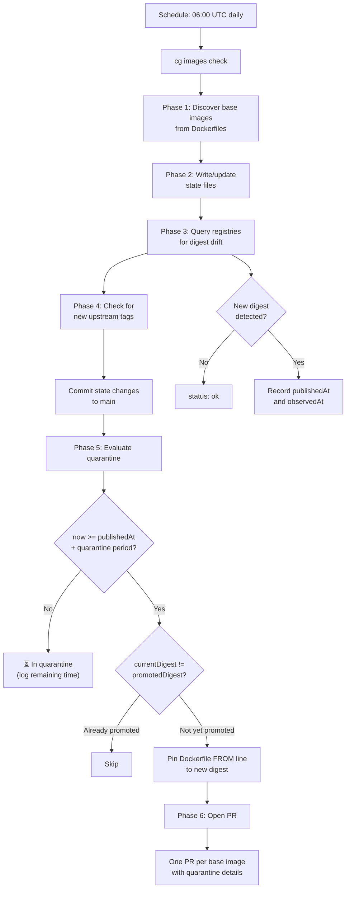
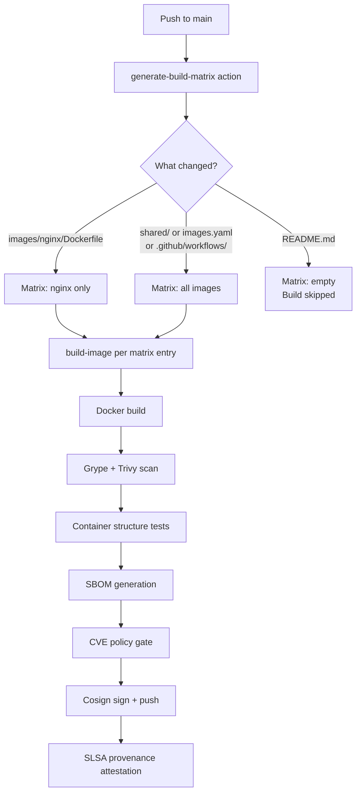
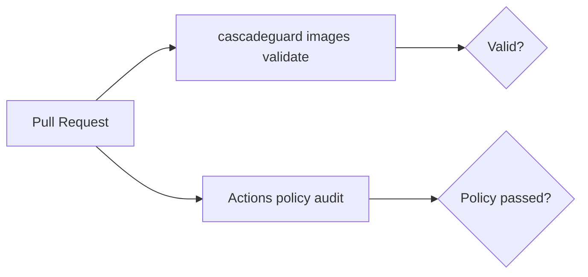

# Pipeline Flow

CascadeGuard manages the lifecycle of container images through two decoupled pipelines: **check** and **build**. They communicate through Git — Dockerfile changes on `main` are the only interface between them.

## Overview



## Check Pipeline

Runs nightly via `check.yaml`. Detects upstream changes and manages the quarantine-to-promotion flow.



### Quarantine

When an upstream base image publishes a new digest, CascadeGuard waits before promoting it. This quarantine period gives time to detect supply chain issues — yanked tags, injected layers, or CVEs reported against the new version.

Quarantine evaluates against `publishedAt` (when the upstream built the image), not when CascadeGuard first observed it. If an image was published 3 days ago but you only checked today, the quarantine clock started 3 days ago.

**Configuration hierarchy** (highest wins):

| Level | Example |
|-------|---------|
| Per-image (`images.yaml`) | `quarantine: 12h` |
| Repo-level (`.cascadeguard.yaml`) | `quarantine: { period: 24h }` |
| Built-in default | `48h` |

Set `quarantine: disabled` or `quarantine: 0` to skip quarantine for a specific image.

### State Model

Each base image has a state file in `.cascadeguard/base-images/`:

```yaml
currentDigest: sha256:bbb...       # latest observed from registry
publishedAt: 2026-04-10T...        # when upstream built this digest
observedAt: 2026-04-13T...         # when we first saw it

promotedDigest: sha256:aaa...      # last digest pinned in Dockerfiles
promotedAt: 2026-04-08T...         # when we promoted it

updateHistory:                     # audit trail (last 10 changes)
  - digest: sha256:aaa...
    publishedAt: 2026-04-05T...
    observedAt: 2026-04-06T...
    promotedAt: 2026-04-08T...
  - digest: sha256:bbb...
    publishedAt: 2026-04-10T...
    observedAt: 2026-04-13T...
    promotedAt: null               # in quarantine
```

### Promotion PRs

When quarantine passes, CascadeGuard opens one PR per base image (dependabot-style):

- **Title**: `chore(deps): bump node-22 in webapp`
- **Body**: quarantine details, affected Dockerfiles, new digest
- **Scope**: only the Dockerfiles that use that base image

This keeps PRs independent — you can merge nginx immediately but hold python if there's a known issue.

## Build Pipeline

Runs on push to `main` via `build.yaml`. Builds only the images whose files changed.



### Changed-File Detection

The `generate-build-matrix` action compares `HEAD~1..HEAD` to determine which image directories were touched. If `shared/`, `images.yaml`, or `.github/workflows/` changed, all images rebuild — these are shared dependencies.

On manual dispatch (`workflow_dispatch`), all images rebuild unless an `image_filter` is specified.

## PR Check Pipeline

Runs on pull requests via `pr-check.yaml`. Lightweight validation only — no image builds.



- **Validate**: checks `images.yaml` schema, required fields, config defaults
- **Policy**: audits workflow files against `.cascadeguard/actions-policy.yaml` — all external actions must be pinned and explicitly allowed

## Workflow Inventory

| Workflow | Trigger | Purpose |
|----------|---------|---------|
| `build.yaml` | Push to main (image paths) | Build changed images |
| `check.yaml` | Nightly cron, manual | Upstream check + quarantine + PR |
| `pr-check.yaml` | Pull request | Validate + policy (no builds) |
| `build-image.yaml` | `workflow_call` | Per-image build/scan/sign |
| `rebuild.yaml` | `repository_dispatch` | Platform-triggered rebuild |
| `release.yaml` | Tag push (`v*`) | Release to registry |

## Shared Actions

All reusable logic lives in [cascadeguard-actions](https://github.com/cascadeguard/cascadeguard-actions):

| Action | Type | Purpose |
|--------|------|---------|
| `setup-cascadeguard` | Composite | Install the CascadeGuard CLI |
| `generate-build-matrix` | Composite | Matrix from images.yaml + changed files |
| `resolve-image` | Composite | Look up image in images.yaml |
| `build-image.yaml` | Reusable workflow | Full build/scan/sign pipeline |
| `check.yaml` | Reusable workflow | Upstream check + quarantine |
| `enforce-actions-policy.yaml` | Reusable workflow | Actions policy audit |
